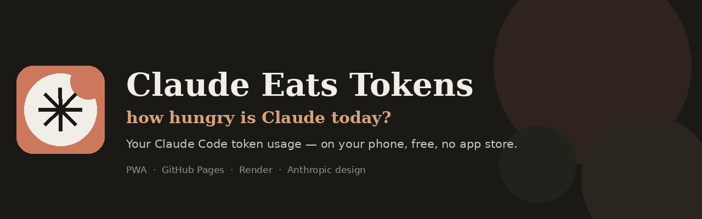
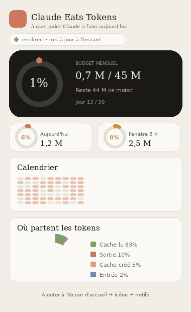
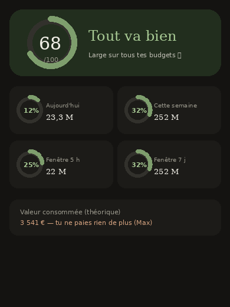
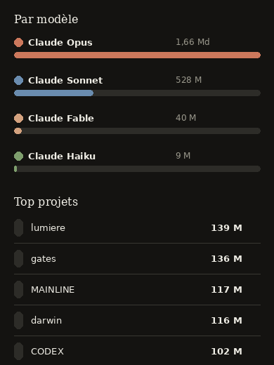

<p align="center">
  
</p>

<h1 align="center">Claude Eats Tokens — how hungry is Claude today?</h1>

<p align="center">
  <b>Claude has a serious appetite. This is the kitchen scale.</b><br>
  Claude Code logs every token it devours; a tiny push server beams the numbers to an installable PWA<br>with budgets, live gauges and alerts — before Claude eats your whole plan.
</p>

<p align="center">
  
  
  
  
  
  
</p>

<p align="center">
  <a href="https://arochab.github.io/claude-eats-tokens/"><b>→ Open the live app</b></a> ·
  <a href="https://github.com/arochab/claude-eats-tokens">Source</a>
</p>

<p align="center">
  
</p>

The joke writes itself — Claude Code is a hungry beast, and you can't see, from your phone, how much it's eaten today. That's not laziness on Anthropic's part: the Max plan genuinely ships **no usage API**, so there's no number to fetch. But Claude Code already writes every token count to local JSONL logs. So this app does the only honest thing: a small script on your PC reads those logs, totals the damage, and pushes it to a free server; an installable web app then shows where you stand — budgets, rolling windows, projections — and pings you before Claude licks the plate clean. Built in the Anthropic design language, free end to end.

---

## What you get

<table>
<tr>
<td width="50%" valign="top">

- **At-a-glance verdict** — a health score out of 100 and a colour that turns the whole screen green / amber / red, so you know where you stand *before* reading a single number.
- **Self-calibrating budgets** — no scary "999%". The app sizes day / week / month / 5h-window / 7d-window ceilings from your real average; you can override them in settings.
- **Rolling windows** — tracks the *actual* Max limit (≈5h usage windows that reset), with a live countdown.
- **Honest cost** — a small "theoretical" euro figure, clearly flagged: on Max you pay a flat fee, so it's *value consumed at API rates*, not a bill.

</td>
<td width="50%" valign="top">

- **Live, hands-off** — a silent engine on your PC pushes every 60s and auto-starts with Windows; a private Gist keeps the numbers alive even when the free server sleeps.
- **Visual breakdown** — calendar heatmap, input/output/cache donut, per-model split (Opus/Sonnet/Haiku/Fable merged across versions), top projects.
- **Threshold notifications** — Web Push at 50 / 80 / 100% of any budget.
- **Installable** — Add to Home Screen → full-screen icon, offline shell, no app store.

</td>
</tr>
</table>

<p align="center">
  
  &nbsp;&nbsp;
  
</p>

## How it works

A static PWA + a tiny push server, glued by Claude's own eating habits:

```
   PC reads ~/.claude/projects   ─►  POST /push  ─►  Render (Flask)  ─►  private Gist (durable store)
        │  (tools/push_usage.py, silent + autostart)        │
        ▼                                                    │ GET /usage.json
   tallies tokens by                                         ▼
   day · week · 5h / 7d window                       PWA on GitHub Pages
   model family · project                            (server → Pages → demo fallback)
```

1. **The PC is the source of truth.** `tools/push_usage.py` reads Claude Code's local JSONL logs, deduplicates streaming entries, merges models by family, cleans project names, and aggregates by day, model, project and rolling windows — there is no cloud API for Max usage, so the logs *are* the data.
2. **A free server holds the latest numbers.** A Flask app on **Render** receives the push (shared-secret guarded) and mirrors it into a **private GitHub Gist**, so the numbers survive the free tier going to sleep.
3. **The PWA shows you where you stand.** Installable from **GitHub Pages**, it reads the freshest source available (Render → Pages → bundled demo) and renders the verdict, rings, heatmap, donut and trends.

## Design system

Built in the Anthropic design language — not bolted on:

- **Palette** — Cream `#F0EEE6` · Slate `#1A1915` · Terracotta `#CC785C` · Clay `#D4A27F` · Sky `#6A8CAF` · Sage `#7E9E6D`
- **Type** — editorial serif for headline numbers, clean sans-serif for UI, generous whitespace
- **Semantics** — gauges shift green → amber → terracotta as you approach a limit; never colour-for-colour's-sake
- **Tone** — calm, precise, mobile-first. Everything lives in `pwa/styles.css`.

## Run it locally

```bash
git clone https://github.com/arochab/claude-eats-tokens.git
cd claude-eats-tokens

# Front end — just open the static site
python -m http.server 8000          # → http://localhost:8000

# Push server (optional)
pip install -r server/requirements.txt
export PUSH_SECRET="a-long-secret"
python server/app.py                # → http://localhost:5000

# Push your real numbers from this PC
export PUSH_URL="http://localhost:5000"
python tools/push_usage.py --once
```

Without a server the app falls back to `data/usage.json`, then to a bundled demo dataset.

## Deploy (free, end to end)

1. **Front → GitHub Pages.** Push to `main`; `.github/workflows/pages.yml` publishes the static site.
2. **Server → Render.** Deploy `server/` via the `render.yaml` blueprint; set `PUSH_SECRET` (+ `GITHUB_TOKEN` and `GIST_ID` for durable storage).
3. **Wire it up.** Put your Render URL in `pwa/config.js`.
4. **Always-fresh PC engine.** Double-click `installer-demarrage-auto.bat` — the pusher runs silently and starts with Windows.
5. **Install on your phone.** Open the Pages URL → *Add to Home Screen* → enable notifications in ⚙️.

Full step-by-step in [`DEPLOIEMENT.md`](DEPLOIEMENT.md) and [`CONFORT-SETUP.md`](CONFORT-SETUP.md).

## Tech & skills demonstrated

- **PWA** — installable manifest, root-scope service worker (network-only data, self-updating), offline shell, threshold Web Notifications.
- **Local-data pipeline** — parsing Claude Code JSONL, dedup, model-family merging, rolling-window aggregation, cost estimation.
- **Zero-cost durable backend** — Flask on Render + a private GitHub Gist as the database, sidestepping ephemeral disk.
- **CI deployment** — GitHub Actions publishes the PWA to Pages on every push.
- **Data visualization** — verdict score, budget rings, calendar heatmap, donut and trend deltas in vanilla JS + Chart.js.
- **Design systems** — the Anthropic palette and editorial type reproduced in pure HTML/CSS.

## Repo map

```
index.html                 landing + dashboard (front root, for Pages scope)
pwa/                       app.js · styles.css · config.js · manifest · icons
service-worker.js · sw.v5.js   cache + push (root scope, self-updating)
data/usage.json            latest numbers (pushed) · usage.demo.json (sample)
server/app.py              Flask push server (Render) + Gist persistence
tools/push_usage.py        PC-side: read logs → aggregate → POST /push
installer-demarrage-auto.bat   silent Windows autostart for the engine
.github/workflows/         pages.yml — deploy PWA on push
assets/                    hero, demo.gif, screenshots
```

## License

[MIT](LICENSE) · Built by [Adam Chabbi](https://github.com/arochab) · [☕ Buy me a coffee](https://buymeacoffee.com/arochab)
